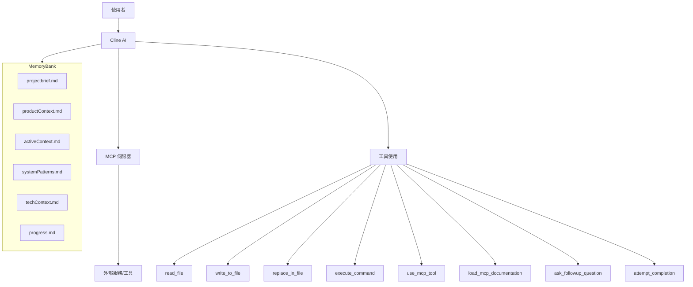

# 系統模式

## 系統架構

本系統圍繞 Cline (AI 軟體工程師)、MCP 伺服器和記憶庫之間的互動而設計。

## 關鍵技術決策

1.  **記憶庫優先**：在執行任何任務之前，必須載入並參考記憶庫。在任務執行期間和之後，必須更新記憶庫。
2.  **MCP 作為擴展**：MCP 伺服器被用作擴展 Cline 核心功能的手段，允許整合專用工具。
3.  **逐步執行**：工具的使用是循序漸進的，每個動作都等待使用者的確認，然後再繼續。
4.  **明確的設定檔**：MCP 伺服器的設定儲存在 `cline_mcp_settings.json` 中，採用明確定義的結構。

## 設計模式

-   **狀態管理**：記憶庫充當 Cline 的狀態管理系統，在會話之間保留其「記憶」。
-   **命令模式**：`execute_command` 和 `use_mcp_tool` 等工具的使用可以被視為命令模式的實現，其中請求被封裝為物件。
-   **代理模式**：Cline 可以被視為使用者與底層工具和 MCP 伺服器之間的代理。
-   **策略模式**：根據任務的不同，Cline 可以選擇不同的工具或 MCP 伺服器 (策略) 來達成目標。

## 元件關係

-   **Cline**：核心決策者和任務執行者。
-   **記憶庫**：Cline 的知識和情境儲存庫。
-   **MCP 伺服器**：提供 Cline 可以利用的專用工具。
-   **`cline_mcp_settings.json`**：MCP 伺服器設定的登錄檔，Cline 依賴此檔案來了解可用的伺服器及其啟動方式。

## 關鍵實作路徑

1.  **記憶庫初始化/載入**：
    - 檢查核心記憶庫檔案是否存在。
    - 如果不存在，則建立它們。
    - 讀取檔案內容以建立當前情境。
2.  **MCP 伺服器設定**：
    - 載入 MCP 文件 (`load_mcp_documentation`)。
    - 讀取現有的 `cline_mcp_settings.json` (`read_file`)。
    - 建立 MCP 伺服器的特定目錄 (`execute_command mkdir`)。
    - 更新 `cline_mcp_settings.json` (`write_to_file` 或 `replace_in_file`) 以包含新的伺服器設定。
    - 根據 README 和使用者作業系統執行安裝命令 (`execute_command`)。
3.  **MCP 工具使用**：
    - 識別需要使用的 MCP 伺服器和工具。
    - 使用 `use_mcp_tool` 呼叫工具，並提供必要的參數。
